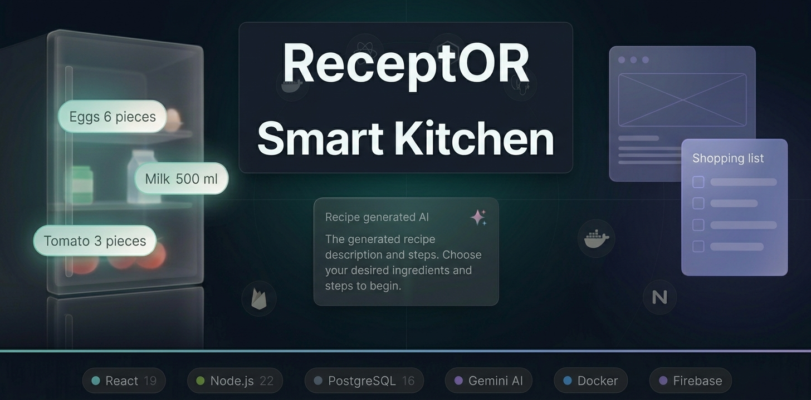
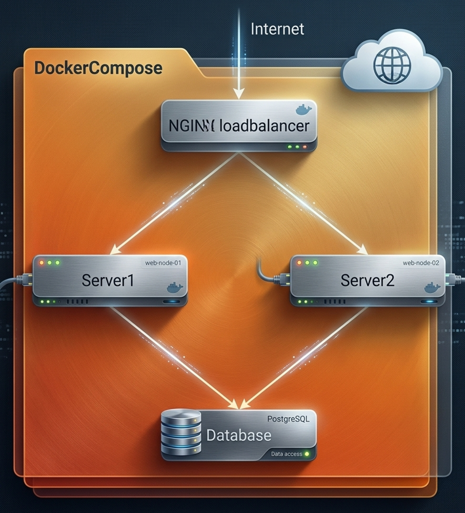

# Smart Kitchen

> A full-stack AI-powered kitchen assistant — track what's in your fridge, manage recipes, build a shopping list, and let Gemini suggest what to cook from what you already have.

[![CI][CI-badge]][CI-url]
[![React][React-badge]][React-url]
[![Vite][Vite-badge]][Vite-url]
[![Node.js][Node-badge]][Node-url]
[![Express][Express-badge]][Express-url]
[![PostgreSQL][PG-badge]][PG-url]
[![Firebase][Firebase-badge]][Firebase-url]
[![Gemini][Gemini-badge]][Gemini-url]

---

<p>
  
</p>

## Table of Contents

- [About The Project](#about-the-project)
- [Architecture](#architecture)
  - [Why two databases](#why-two-databases)
  - [Built With](#built-with)
- [Getting Started](#getting-started)
  - [Prerequisites](#prerequisites)
  - [Installation](#installation)
  - [Running the app](#running-the-app)
- [Usage](#usage)
- [API Endpoints](#api-endpoints)
- [Testing](#testing)
- [Deployment](#deployment)
- [Local Docker demo (archived)](#local-docker-demo-archived)
- [Roadmap](#roadmap)
- [License](#license)

---

## About The Project

Smart Kitchen helps you run a household kitchen: keep an inventory of your fridge, save
and scale recipes, maintain a shopping list, and use **Google Gemini** to generate
recipes — either by name, or from the ingredients you actually have.

The UI is a single-view, tab-driven app: on desktop the tab bar sits on top, and below
768px the same five views get a bottom tab bar.

**Features**

- **Fridge inventory** — items grouped automatically into pantry categories, with amount/unit steppers
- **Recipe manager** — create, edit, tag, filter and search recipes; amounts rescale with the serving count
- **Cook mode** — step-by-step, large-type view for reading from across the kitchen
- **Shopping list** — tick items off as you shop, then move the list into the fridge in one action
- **Unit-aware merging** — adding "2 dl" to an existing "1 l" merges instead of duplicating
- **Ingredient matching** — a recipe shows what you already have vs. what's missing, then adds the missing items to your list
- **Pantry catalog** — a curated, aliased, prioritised catalog in PostgreSQL drives categorisation and "you're out of staples" suggestions
- **AI recipe generation** — by dish name, or restricted to your fridge contents
- **Firebase Authentication** — email/password or Google sign-in

---

## Architecture

<p>
  
</p>

```
React SPA (static)
   │
   ├── Firebase Auth ──────────── sign-in, issues ID tokens
   │
   ├── Cloud Firestore ────────── per-user data, real-time (onSnapshot)
   │                              users/{uid}/{recipes,fridge,shoppingList}
   │
   └── Express API ────┬───────── POST /api/ai/*      → Google Gemini
                       │          (Firebase ID token verified, rate limited)
                       │
                       └───────── GET  /api/pantry/catalog → PostgreSQL
```

The browser talks to Firestore **directly** — that is what makes the real-time sync
work, and access is scoped per user by Firestore security rules. The Express service
exists for the two things a browser must not do: hold the Gemini API key, and query
PostgreSQL.

### Why two databases

This is deliberate polyglot persistence, not accident:

| Data | Store | Reason |
|---|---|---|
| Fridge, shopping list, saved recipes | **Cloud Firestore** | Private and per-user, wants real-time push (`onSnapshot`) and user-scoped security rules, not relational queries |
| Pantry catalog (categories, items, aliases, priorities) | **PostgreSQL** | Global, shared, genuinely relational: categories → items → aliases, with uniqueness constraints on normalized keys |

The catalog's `normalized_key` columns deserve a note: accent-stripping and
lowercasing is an *algorithm*, not data. The keys are computed at seed time by
[`backend/lib/normalize.js`](backend/lib/normalize.js), and incoming runtime text is
normalized by that **same module** — so stored keys and lookups cannot drift apart.

### Built With

| Layer | Technology |
|---|---|
| Frontend | React 19, Vite 7, Three.js (animated background), Firebase JS SDK |
| Backend | Node.js 22, Express 5, `pg`, `zod`, `helmet`, `express-rate-limit`, `firebase-admin` |
| Databases | PostgreSQL 16 (pantry catalog), Cloud Firestore (per-user data) |
| Auth | Firebase Authentication |
| AI | Google Gemini (`gemini-3.6-flash`) via `@google/generative-ai` |
| Tests / CI | Vitest, GitHub Actions |

Icons are inlined Font Awesome Free SVG paths — no icon webfont is shipped.

---

## Getting Started

The app runs as **two processes**: the Express API and the Vite dev server. You also
need a PostgreSQL instance and a Firebase project.

### Prerequisites

- **Node.js 22** (or 18+)
- **PostgreSQL 16** — either installed locally, a Docker container, or a free managed
  instance ([Neon](https://neon.tech/) / [Supabase](https://supabase.com/))
- A **Google Gemini API key** — free at [Google AI Studio](https://aistudio.google.com/app/apikey)
- A **Firebase project** — create one at the [Firebase Console](https://console.firebase.google.com/), then:
  - **Authentication** → enable *Email/Password* and *Google*
  - **Firestore Database** → create it, and restrict access to the signed-in owner:

    ```
    rules_version = '2';
    service cloud.firestore {
      match /databases/{database}/documents {
        match /users/{uid}/{document=**} {
          allow read, write: if request.auth != null && request.auth.uid == uid;
        }
      }
    }
    ```

  - **Project Settings → Service accounts → Generate new private key** — the backend
    needs this to verify ID tokens

### Installation

**1. Clone and install**

```bash
git clone https://github.com/KovyD20/Smart-Kitchen-Project.git
cd Smart-Kitchen-Project
(cd backend && npm install)
(cd frontend && npm install)
```

**2. Configure the backend**

```bash
cp backend/.env.example backend/.env
```

Fill in `backend/.env`: your PostgreSQL connection, `GEMINI_API_KEY`, and the three
`FIREBASE_*` values from the service-account JSON. Every variable is documented inline
in the example file.

> The Gemini key lives **only** here. It must never reach the frontend — that bundle is
> public, and anyone could lift the key and burn your quota. This is the main reason a
> separate backend exists at all.

**3. Configure the frontend**

```bash
cp frontend/.env.local.example frontend/.env.local
```

Fill in the `VITE_FIREBASE_*` values from Firebase Console → Project Settings → Your
apps. Leave `VITE_API_BASE_URL` **empty** for local development — Vite's dev proxy
forwards `/api` to `localhost:3000`.

**4. Create and seed the pantry catalog**

```bash
cd backend
npm run db:setup     # applies db/schema.sql, then seeds the catalog
```

`npm run migrate` and `npm run seed` can also be run separately. The schema is
idempotent and safe to re-apply; **seeding truncates the catalog tables** and rebuilds
them from `scripts/pantrySeedData.js`.

### Running the app

Two terminals:

```bash
# Terminal 1 — API on :3000
cd backend && npm run dev

# Terminal 2 — SPA on :5173
cd frontend && npm run dev
```

Open **http://localhost:5173**.

---

## Usage

Sign in with email/password or Google, then work through the five tabs:

- **Receptek** — browse, search and filter recipes by tag
- **Recept** — the selected recipe: ingredients, steps, and what's already in your
  fridge. Adjust servings to rescale amounts, push missing items to the shopping list,
  or start **Főzés mód** (step-by-step cook mode; arrow keys and `Esc` work)
- **Bevásárlólista** — grouped by pantry category; tick items off, then "Hűtőbe rak"
  moves the whole list into the fridge, merging units as it goes
- **Hűtő** — your inventory, same grouped layout
- **Új recept** — enter a recipe by hand, or have Gemini generate one by name or from
  your fridge contents, then save it to your own recipes

The search box in the header spans recipes (name, tags, ingredients) as well as
shopping-list and fridge item names, and is accent-insensitive — `turos` finds
*Túrós csusza*.

---

## API Endpoints

| Method | Path | Auth | Description |
|---|---|---|---|
| `GET` | `/health` | — | Liveness probe; returns `INSTANCE_NAME`. No DB access |
| `GET` | `/api/db/health` | — | Readiness probe; confirms PostgreSQL connectivity |
| `GET` | `/api/pantry/catalog` | — | Full pantry catalog (categories → items → aliases) |
| `POST` | `/api/ai/recipe-by-name` | Bearer | Generate a recipe from a dish name |
| `POST` | `/api/ai/suggest-from-fridge` | Bearer | Suggest dish ideas from fridge contents |
| `POST` | `/api/ai/recipe-from-fridge` | Bearer | Generate a full recipe restricted to fridge contents |

`Bearer` means a Firebase ID token in `Authorization: Bearer <token>`; those routes are
also rate limited to **20 requests per 15 minutes per user**. Request bodies are
validated with `zod`. Recipe, fridge and shopping-list CRUD is **not** here — the client
does that against Firestore directly.

`restclient-test.http` has ready-made requests for the VS Code REST Client extension.

---

## Testing

```bash
cd backend  && npm test        # unit tests: normalize, AI JSON handling
cd frontend && npm test        # unit tests: unit conversion, catalog grouping
cd frontend && npm run lint
```

Coverage focuses on the real business logic — unit conversion and merging, catalog
normalisation and alias resolution, and Gemini error/JSON handling — rather than a
coverage percentage. [GitHub Actions][CI-url] runs lint, tests and build for both
workspaces on every push and pull request to `master`.

---

## Deployment

The frontend is a static bundle and the backend is a small Node service, so they deploy
to different hosts. All free tier, all auto-deploy on push:

| Part | Host | Config in repo |
|---|---|---|
| Frontend (React build) | **Vercel** | [`frontend/vercel.json`](frontend/vercel.json) |
| Backend (Express) | **Render** | [`render.yaml`](render.yaml) blueprint |
| PostgreSQL (pantry catalog) | **Neon** | connection string → `DB_*` vars |
| Auth + per-user data | **Firebase** | free tier |

**➡️ [Full step-by-step guide: DEPLOY.md](DEPLOY.md)** — registration, every setting,
every environment variable, and troubleshooting.

The backend is described entirely by a committed blueprint: point Render at the repo and
it creates the service from `render.yaml`, prompting once for the values marked
`sync: false` so no secret is committed.

**Free-tier caveat:** Render spins the service down after 15 minutes idle and takes
30–60 s to wake. That only affects the catalog fetch and the first AI call — Auth and
Firestore are hit directly from the browser, so sign-in and your own data are always
instant — but a 10-minute keep-warm ping to `/health` removes it entirely. DEPLOY.md
covers the setup.

**What is NOT deployed:** the Docker Compose + Nginx load-balancer setup below. Managed
hosts do their own routing and scaling; pushing a hand-rolled reverse proxy alongside
would be pointless.

---

## Local Docker demo (archived)

An earlier iteration ran the whole stack in Docker Compose — Nginx as reverse proxy and
round-robin load balancer over **two** backend replicas, plus a PostgreSQL container.
It is kept in [`archive/`](archive/) as a self-contained infrastructure demo:

```
archive/
├── docker-compose.yml           # nginx + backend1 + backend2 + postgres
├── backend/Dockerfile
├── infra/nginx/nginx.conf       # reverse proxy + upstream load balancing
├── infra/postgres/init.sql      # superseded by backend/db/schema.sql
└── scripts/                     # logs, restart, in-container helpers
```

Because both replicas report their own `INSTANCE_NAME` from `/api/db/health`, hitting
that endpoint repeatedly shows Nginx round-robining between them.

**This is not the current way to run the app** — it predates the Firestore/PostgreSQL
split and the environment layout described above, so the compose files would need
updating before they run again. Use the [Getting Started](#getting-started) flow instead.

---

## Roadmap

- [ ] Public recipe library as a second PostgreSQL domain — browsable without signing
      in, with likes and Postgres full-text search over names and ingredients
- [ ] Live public demo link
- [ ] Expiry-date tracking for fridge items
- [ ] Component-level frontend tests (Testing Library)
- [ ] Backend integration tests against a Postgres service container in CI

---

## License

Distributed under the MIT License.

<!-- Badge links -->
[CI-badge]: https://github.com/KovyD20/Smart-Kitchen-Project/actions/workflows/ci.yml/badge.svg
[CI-url]: https://github.com/KovyD20/Smart-Kitchen-Project/actions/workflows/ci.yml
[React-badge]: https://img.shields.io/badge/React_19-20232A?style=for-the-badge&logo=react&logoColor=61DAFB
[React-url]: https://react.dev/
[Vite-badge]: https://img.shields.io/badge/Vite_7-646CFF?style=for-the-badge&logo=vite&logoColor=white
[Vite-url]: https://vite.dev/
[Node-badge]: https://img.shields.io/badge/Node.js_22-339933?style=for-the-badge&logo=nodedotjs&logoColor=white
[Node-url]: https://nodejs.org/
[Express-badge]: https://img.shields.io/badge/Express_5-000000?style=for-the-badge&logo=express&logoColor=white
[Express-url]: https://expressjs.com/
[PG-badge]: https://img.shields.io/badge/PostgreSQL_16-4169E1?style=for-the-badge&logo=postgresql&logoColor=white
[PG-url]: https://www.postgresql.org/
[Firebase-badge]: https://img.shields.io/badge/Firebase-FFCA28?style=for-the-badge&logo=firebase&logoColor=black
[Firebase-url]: https://firebase.google.com/
[Gemini-badge]: https://img.shields.io/badge/Google_Gemini-4285F4?style=for-the-badge&logo=google&logoColor=white
[Gemini-url]: https://ai.google.dev/
